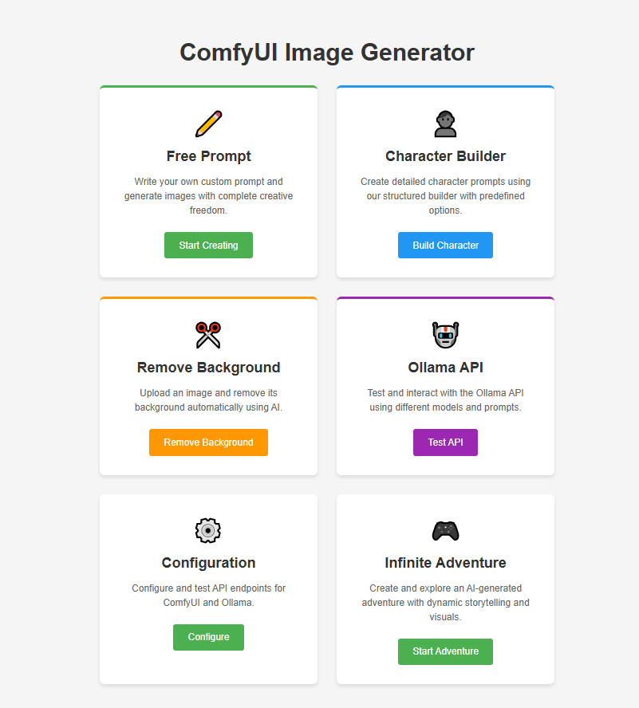
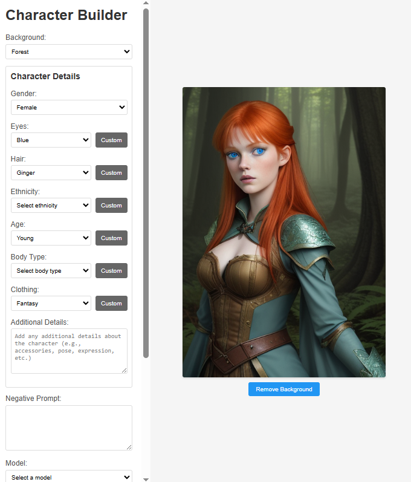
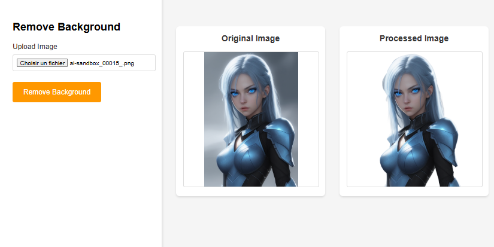
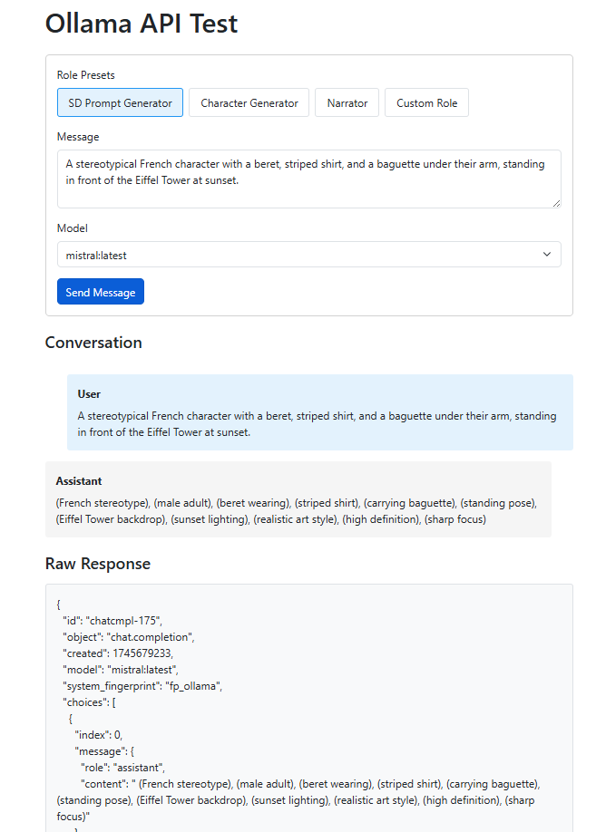
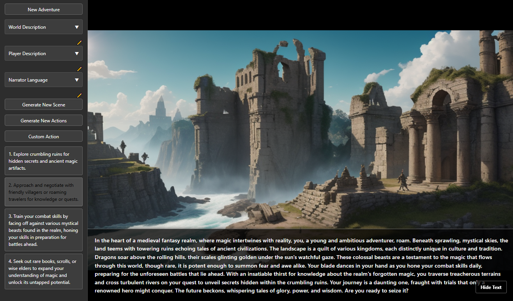
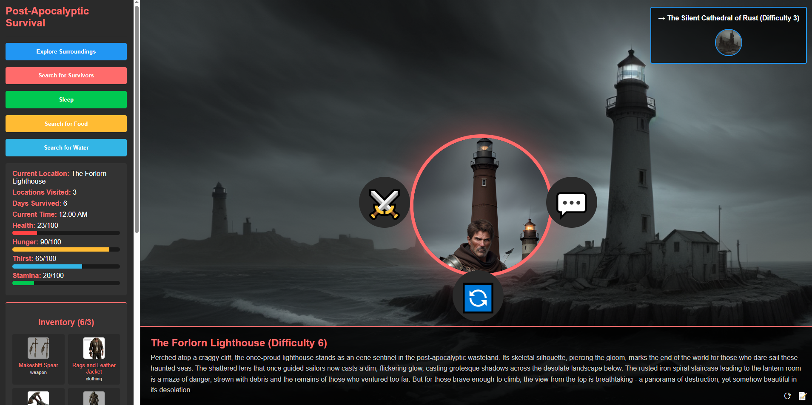

# Local AI API Sandbox

A comprehensive web interface for interacting with local AI services, including ComfyUI for image generation and Ollama for text generation. The project provides a sandbox environment for testing and integrating various AI capabilities through a unified web interface.
Requieres https://www.comfy.org/ & https://ollama.com/ endpoints (local or hosted)
sponsored link to templated server rental: https://cloud.vast.ai/?ref_id=241042 or https://cloud.vast.ai with no affiliation.

## Features

- **Image Generation**: Generate images using ComfyUI with customizable prompts and models
- **Background Removal**: Remove backgrounds from images using the Rembg node
- **AI-Powered Prompt Generation**: Generate and enhance prompts using Ollama
- **Infinite Adventure**: Create and explore AI-generated worlds with persistent state
- **Configuration Management**: Easy setup and testing of AI service endpoints
- **Node Testing**: Verify the presence and functionality of required ComfyUI nodes
- **Web UI**: User-friendly interface for all operations
- **ComfyUI Integration**: Seamless integration with ComfyUI for image generation
  - Default model: [DreamShaper 8](https://civitai.com/models/4384/dreamshaper)
  - Support for custom models and configurations

## Screenshots

<div align="center">
  
  <p><em>Main Interface - Overview of all available features</em></p>

  
  <p><em>Prompt Builder - Create detailed character descriptions</em></p>

  
  <p><em>Background Removal - Remove backgrounds from images</em></p>

  
  <p><em>Ollama API sandbox</em></p>

  
  <p><em>Infinite Adventure - Explore AI-generated worlds</em></p>

  
  <p><em>Survival Game - AI-powered survival simulation</em></p>

  
</div>

## Prerequisites

- Docker and Docker Compose installed
- Local ComfyUI instance running
- Ollama instance running (optional, for AI prompt generation)
- Make (usually pre-installed on Linux/Mac, available via WSL on Windows)

## Project Structure

```
.
├── Dockerfile           # Container configuration
├── docker-compose.yml   # Docker services configuration
├── Makefile            # Build and management commands
├── webui.js            # Web UI server
├── views/              # Web UI templates
│   ├── index.ejs       # Main web UI template
│   ├── config.ejs      # Configuration page
│   ├── free-prompt.ejs # Free prompt generation page
│   ├── prompt-builder.ejs # Character builder page
│   ├── remove-background.ejs # Background removal page
│   └── infinite-adventure.ejs # Infinite Adventure page
└── public/             # Static files
    └── images/         # Generated images
```

## Getting Started

1. Ensure your local ComfyUI instance is running
2. (Optional) Ensure your Ollama instance is running
3. Build and start the service:
   ```bash
   make build
   make webui
   ```
4. Access the web UI at http://localhost:3000

## Web UI Features

### Image Generation
- Generate images using ComfyUI
- Customize prompts and negative prompts
- Select from available models
- View generated images with error handling

### Background Removal
- Upload images for background removal
- Uses the ComfyUI-Inspyrenet-Rembg node
- View original and processed images
- Download processed images

### AI-Powered Prompt Generation
- Generate prompts using Ollama
- Character builder with customizable attributes
- Free prompt generation with AI assistance
- Conversation history for context

### Infinite Adventure
- Create and explore AI-generated worlds
- Persistent world state across sessions
- Customizable world and character descriptions
- Multi-language support for narration
- Dynamic scene generation with AI
- Interactive narrative progression

### Configuration Management
- Configure ComfyUI and Ollama endpoints
- Test connection to services
- Verify required nodes (e.g., Rembg)
- View installation instructions for missing components

### Survival Game
- AI-powered survival simulation game
- Dynamic world generation with ComfyUI
- Real-time status tracking (health, hunger, thirst, energy)
- Day/night cycle with time management
- Resource gathering and crafting system
- AI-generated events and challenges
- Persistent game state across sessions
- Customizable character and world settings
- Interactive decision-making with AI consequences
- Weather system affecting gameplay
- Inventory management
- Base building and territory expansion
- AI-driven NPC interactions
- Dynamic difficulty scaling
- Survival statistics and achievements

The survival game combines AI image generation with interactive gameplay elements. The world and events are dynamically generated using ComfyUI, while the game mechanics are managed through a sophisticated state system. Players must manage their character's basic needs while exploring, gathering resources, and building their base. The AI generates unique challenges and events based on the player's current situation, making each playthrough different.

Key features:
- **Dynamic World Generation**: The game world is procedurally generated using AI, creating unique landscapes and environments
- **Resource Management**: Players must balance health, hunger, thirst, and energy while gathering resources
- **Crafting System**: Create tools, weapons, and shelter using gathered materials
- **AI Events**: Random events and challenges are generated based on the current game state
- **Day/Night Cycle**: Time management affects gameplay and resource availability
- **Weather System**: Dynamic weather affects gameplay mechanics and survival strategies
- **NPC Interactions**: AI-driven characters with unique behaviors and responses
- **Base Building**: Construct and expand your survival base
- **Achievement System**: Track progress and unlock special rewards

The game uses ComfyUI for generating the visual elements of the world and events, while maintaining a persistent state to track the player's progress and the world's evolution. The AI integration allows for dynamic storytelling and unique gameplay experiences with each session.

## Available Commands

- `make build` - Build the Docker image
- `make up` - Start the service
- `make down` - Stop the service
- `make logs` - View logs
- `make ps` - List running containers
- `make clean` - Clean up Docker resources
- `make shell` - Shell into the container
- `make check-comfyui` - Check if local ComfyUI is running
- `make webui` - Start the web UI
- `make help` - Show all available commands

## Environment Configuration

The service connects to your local AI services using the following configuration:

```yaml
environment:
  - COMFYUI_API=http://host.docker.internal:8188/api
  - OLLAMA_URL=http://host.docker.internal:11434
```

## Required ComfyUI Nodes

The project requires the following ComfyUI custom nodes:

1. **ComfyUI-Inspyrenet-Rembg**
   - Used for background removal
   - Installation:
     ```bash
     cd ComfyUI/custom_nodes
     git clone https://github.com/ltdrdata/ComfyUI-Inspyrenet-Rembg.git
     ```

## Development

To access the container's shell for debugging:
```bash
make shell
```

To view logs:
```bash
make logs
```

## Cleaning Up

To stop and remove all containers:
```bash
make down
make clean
```

## Troubleshooting

1. **ComfyUI Connection Issues**
   - Ensure ComfyUI is running and accessible
   - Check the configuration page for connection status
   - Verify the ComfyUI URL in the configuration

2. **Rembg Node Not Found**
   - Check the configuration page for installation instructions
   - Ensure the node is properly installed in ComfyUI
   - Restart ComfyUI after installing the node

3. **Ollama Connection Issues**
   - Ensure Ollama is running and accessible
   - Check the configuration page for connection status
   - Verify the Ollama URL in the configuration

4. **Infinite Adventure Issues**
   - Ensure both ComfyUI and Ollama are properly configured
   - Check that the selected language is supported
   - Verify that world and character descriptions are provided
   - Clear browser cache if world state becomes corrupted

## License

ISC

## Contributing

Contributions are welcome! Please feel free to submit a Pull Request. 